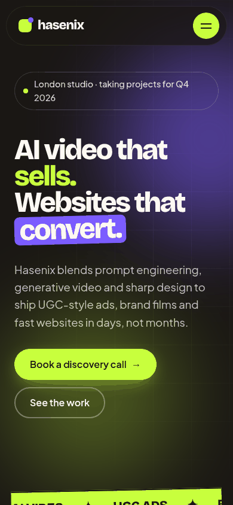
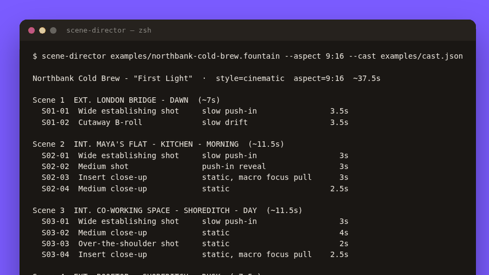
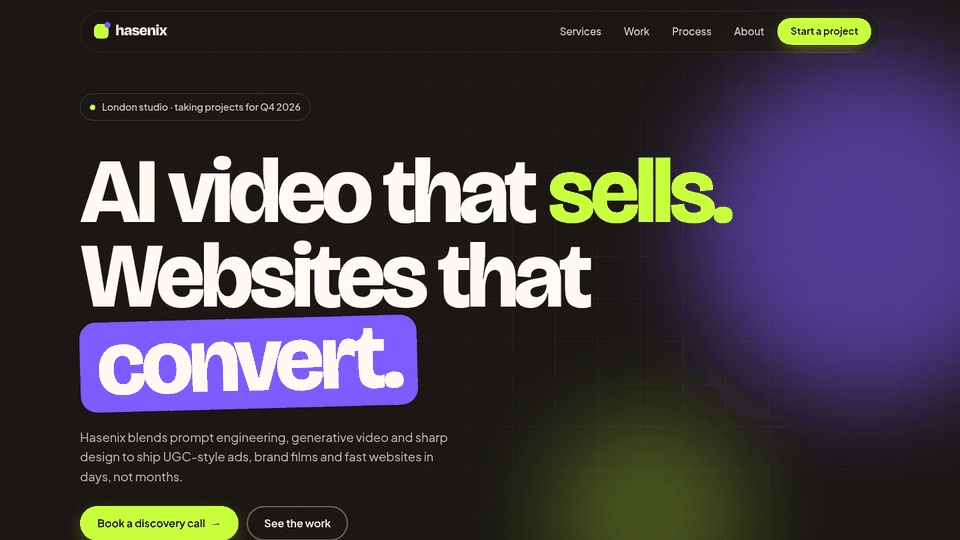
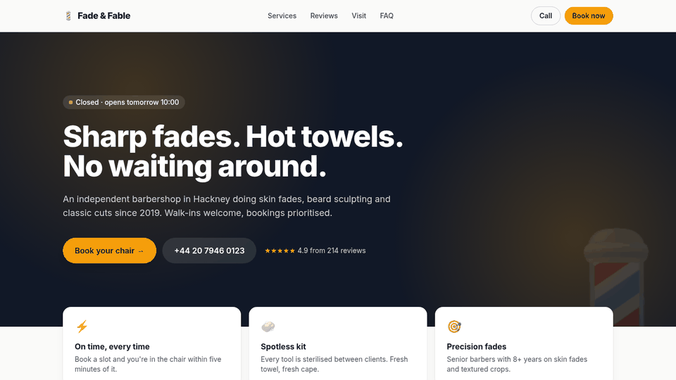

<!-- ═══════════════════════════ HERO ═══════════════════════════ -->

  

<!-- ═══════════════════════════ NAV ═══════════════════════════ -->

  
  
  
  
  

  

 

<!-- ═══════════════════════════ ABOUT ═══════════════════════════ -->

<code>01</code> &nbsp;ABOUT

## About me

<table>
  <tr>
    <td width="58%" valign="top">
      <h3>Hey, I'm Hassan 👋</h3>
      

        I'm the founder of <a href="https://hasenix.com"><b>Hasenix</b></a>, a UK creative studio making
        <b>AI video, UGC and marketing</b> for artists and brands, and <b>websites for London businesses</b>.
      

      

        I'm a <b>prompt engineer</b> at heart: I build <b>multi-agent workflows</b>, <b>AI video pipelines</b>
        and the automation that ties them together. Based in London, where I'm also studying IT.
      

    </td>
    <td width="42%" valign="top">
      <h3>⚡ Currently</h3>
      <ul>
        <li>🎬 Building <a href="https://hasenix.com">Hasenix</a></li>
        <li>🛠️ Shipping open-source AI tools</li>
        <li>🤖 Exploring multi-agent systems</li>
      </ul>
    </td>
  </tr>
</table>

  
  
  
  

 

<!-- ═══════════════════════════ NOW BUILDING ═══════════════════════════ -->

<code>02</code> &nbsp;NOW BUILDING

## Now building

<table>
  <tr>
    <td width="66%" valign="middle">
      <h3><a href="https://hasenix.com">Hasenix</a> &nbsp;· London, UK</h3>
      

        A UK creative studio I founded. We make <b>AI videos, UGC and marketing</b> for
        <b>artists and brands</b>, and design <b>websites for London businesses</b>.
      

      

        The idea is simple: use AI for speed and volume, use taste to decide what actually ships.
        Behind the studio sits a stack of my own tools for scripting, prompting and automating the work.
      

      

        
        
      

    </td>
    <td width="34%" align="center" valign="middle">
      
    </td>
  </tr>
</table>

 

<!-- ═══════════════════════════ WHAT I DO ═══════════════════════════ -->

<code>03</code> &nbsp;VENTURES &amp; CRAFT

## What I do

<table>
  <tr>
    <td width="33%" valign="top">
      <h3>🎬 AI video &amp; UGC</h3>
      
Music visuals, ads and short-form content for artists and brands. Script, shot list, generation, edit: one pipeline, end to end.

      <b>Hasenix</b> · scene-director
    </td>
    <td width="33%" valign="top">
      <h3>🤖 AI systems</h3>
      
Prompt engineering, multi-agent workflows and automation. Small, traceable systems that turn models into reliable tools.

      prompt-forge · agent-relay
    </td>
    <td width="33%" valign="top">
      <h3>🌐 Web for London</h3>
      
Fast, SEO-ready websites for local businesses, plus full-stack TypeScript apps when a site isn't enough.

      local-biz-template · lexcore
    </td>
  </tr>
</table>

 

<!-- ═══════════════════════════ SELECTED WORK ═══════════════════════════ -->

<code>04</code> &nbsp;SELECTED WORK

## Selected work

<table>
  <tr>
    <td width="33%" valign="top">
      
      <h4><a href="https://github.com/hbtabi/scene-director">scene-director</a></h4>
      
Turns a screenplay into a scene-by-scene AI video shot list with ready-to-paste prompts and consistent characters.

      <code>Python</code> <code>CLI</code> <code>AI video</code>
    </td>
    <td width="33%" valign="top">
      
      <h4><a href="https://github.com/hbtabi/agent-relay">agent-relay</a></h4>
      
Lightweight multi-agent orchestration: planner, researcher and writer agents relaying typed messages over a traceable bus.

      <code>TypeScript</code> <code>Node.js</code> <code>Agents</code>
    </td>
    <td width="33%" valign="top">
      
      <h4><a href="https://github.com/hbtabi/prompt-forge">prompt-forge</a></h4>
      
Versioned prompt templates and a rubric-based eval harness, so you know <i>v2</i> beats <i>v1</i> before it ships. Offline-first.

      <code>Python</code> <code>LLM evals</code> <code>CI</code>
    </td>
  </tr>
  <tr>
    <td width="33%" valign="top">
      
      <h4><a href="https://github.com/hbtabi/hasenix-portfolio">hasenix-portfolio</a></h4>
      
Animated single-page site for the studio: on-brand design system, scroll motion, accessible and SEO-ready, no framework.

      <code>HTML</code> <code>CSS</code> <code>Vanilla JS</code>
    </td>
    <td width="33%" valign="top">
      
      <h4><a href="https://github.com/hbtabi/local-biz-template">local-biz-template</a></h4>
      
One JSON file in, a fast, SEO-ready site out, built for London barbers, cafés and trades.

      <code>Tailwind</code> <code>Node.js</code> <code>schema.org</code>
    </td>
    <td width="33%" valign="top">
      
      <h4><a href="https://github.com/hbtabi/lexcore">lexcore</a></h4>
      
LexCore AI, a cinematic legal intelligence platform: full-stack web app with 3D, motion and a typed API layer.

      <code>TypeScript</code> <code>React</code> <code>Three.js</code> <code>tRPC</code>
    </td>
  </tr>
</table>

 

<!-- ═══════════════════════════ HOW I WORK ═══════════════════════════ -->

<code>05</code> &nbsp;PRINCIPLES

## How I work

<table>
  <tr>
    <td width="50%" valign="top"><b>01 · Ship the thing.</b> A working demo beats a perfect deck. Make it real, then make it better.</td>
    <td width="50%" valign="top"><b>02 · Prompts are code.</b> Versioned, diffed and tested. If I can't measure it, I don't trust it.</td>
  </tr>
  <tr>
    <td width="50%" valign="top"><b>03 · Agents earn their place.</b> Small, readable and traceable. Every message is logged, every run can be replayed.</td>
    <td width="50%" valign="top"><b>04 · Taste is the moat.</b> AI gives you volume. Judgement decides what's good enough to put a name on.</td>
  </tr>
  <tr>
    <td width="50%" valign="top"><b>05 · Build for real businesses.</b> Fast pages, clear offers, easy booking. No bloat for the sake of it.</td>
    <td width="50%" valign="top"><b>06 · Own the pipeline.</b> When a step is tedious, I build a tool for it and keep it.</td>
  </tr>
</table>

 

<!-- ═══════════════════════════ STACK ═══════════════════════════ -->

<code>06</code> &nbsp;TOOLKIT

## Stack

  

 

<!-- ═══════════════════════════ ACTIVITY (subtle) ═══════════════════════════ -->

<code>07</code> &nbsp;ACTIVITY

## Activity

  

<picture>
  <source media="(prefers-color-scheme: dark)" srcset="https://raw.githubusercontent.com/hbtabi/hbtabi/output/github-snake-dark.svg" />
  <source media="(prefers-color-scheme: light)" srcset="https://raw.githubusercontent.com/hbtabi/hbtabi/output/github-snake.svg" />
  
</picture>

 

<!-- ═══════════════════════════ CONTACT ═══════════════════════════ -->

<code>08</code> &nbsp;LET'S TALK

## Contact

**Got an artist, a brand or a London business that needs AI video, UGC or a sharp website?** Tell me what you're making. I'll tell you how I'd build it.

 

&nbsp;&nbsp;

Mohammed Hassan bin Tayyeb · Founder, Hasenix · London, UK

